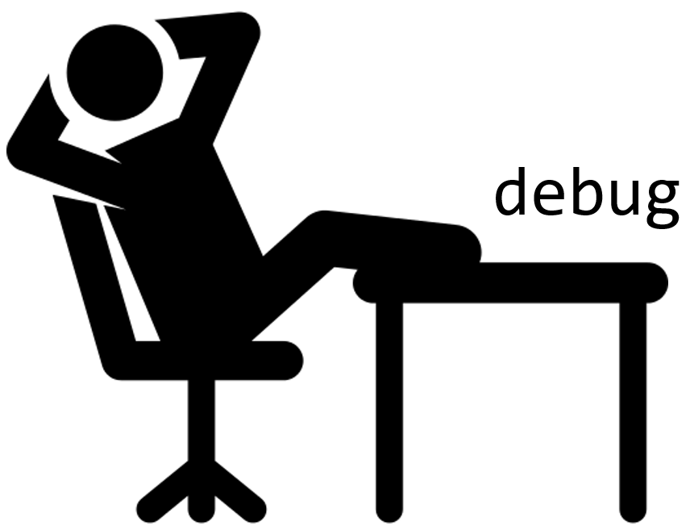

# gdbContextDiffer
- Developed by Jiwon Choi
- jiwon.choi@kaist.ac.kr
 

## About gdbContextDiffer  

Compare register context before/after executing the instruction.  

    Assume that we're searching about instruction 'lar'   
    When we search on Google, we found intel instruction set document.
    ...But is extremely long and hard to understand.  
    To understand exactly what 'lar' is, we can try execute it and compare the context using gdb.   
    ...But It's bothinering to debug each instruction.  
    So I developed gdbContextDiffer, automatically compares register context before/after executing instruction.  
 

## Prepare  
Set symbol *"here"* at the inspecting instruction.  
For example, if you're curious about *bsf*, set symbol like below.   
    
    [...omit...]   
    here:  
       bsf MYSYM, %ebx  
    [...omit...]  
    
 

## Run gdbdiff
    $ sudo apt-get install meld # graphical diff tools  
    $ git clone https://github.com/eternalklaus/gdbContextDiffer.git  
    $ cd gdbContextDiffer  
    $ python gdbdiff.py test.s  
   

Enjoy gdbContextDiffer!  

